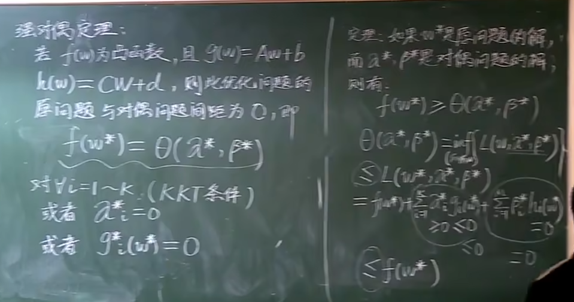

# SVM证明过程
支持向量机

## 1
第一步：定义训练数据以及标签
$$ (x_{1},y_{1}),(x_{2},y_{2})$$
其中x是向量，y代表的是标签，如果是二维坐标则X代表的是x_1,x_2，标签y代表的是+1或-1，属于二分类问题
第二步：找到线性模型
$$ (W,b)$$
$$ W^TX+b=0$$
其中W是向量， b为常数
W^T*X也是一个常数

## 2
一个训练集线性可分是指：
$$ \{ ({x}_{i},{y}_{i})\} i=1…n $$ $$ \exists (W,b) $$
使得$$ \forall i=1… N $$
有a：若y_i=1,则
$$ W^TX_{i}+b\gg0\,\,\,\,\,\,\,(1)$$
b：若y_i=-1。则
$$ W^TX_{i}+b<0$$
由式a，b可得$$ {y}_{i}[{W}^{T}{X}_{i}+b]\gg 0 $$

## 3
根据已有的事实1：
$$ W^TX+b=0$$ 和
$$ aW^TX+ab=0$$是同一个平面，其中a是一个正实数，若(w,b)满足公式1，则(aW,aW)也满足公式1

事实2：点到平面距离公式
平面为
$$ {w}_{1}x+{w}_{2}y+b=0$$
则(x_0,y_0)到此平面的距离为
$$ d=\frac {|{w}_{1}{x}_{0}+{w}_{2}{y}_{0}+b|} {\sqrt {{w}^{2}_{1}+{w}^{2}_{2}}} $$
则向量X_0到超平面的距离为
$$ d=\frac {|{w}^{T}{x}_{0}+b|} {||W||} $$
由于平面不可变，但我们可以用a去缩放（w,b）得到(aw,ab)最终使得在支持向量x_0上有
$$ |W^TX_{0}+b| = 1$$
$$ d=\frac {1} {||W||} $$

## 4
svm问题实际优化问题是一个凸优化问题，也称二次规划问题
最小化(Minimize):
$$ \frac{1}{2}||w||^ 2 =\frac{1}{2}(||w_{1}||^2+||w_{2}||^2+…||w_{n}||^2)$$
限制条件(subject to):
$$ {y}_{i}[{w}^{T}{x}_{i}+b]\gg 1\, (i=1…N) $$
二次规划(quadratic progamming)
1.目标函数为二次项
2.限制条件为一次项

由于目标函数为二次，限制为一次，他的函数解要么无解，要么只有一个极值解
## 5 
### svm处理非线性问题
方法一：引入松弛变量scale variable
最小化：$$ \frac {1} {2}{||W||}^{2}+C\sum ^{N}_{i=1} {{\epsilon }_{i}} $$
限制条件：
1.$$ {y}_{i}[{W}^{T}X+b]\gg 1-ε  (i=1…N) $$
2.$$ ε \gg 0$$
方法二：引入核函数K使得低维向量映射到高维
K(x_1,x_2)能够写成$$ \phi ({x}_{1})\phi ({x}_{2}) $$的充要条件：交换性
$$ 1.K({x}_{1},{x}_{2})=K({x}_{2},{x}_{1}) $$
半正定性
$$ 2.\forall {C}_{i},{x}_{i}(i=1\sim N) $$
C为常数，x为向量有：
$$ \sum ^{N}_{i=1} {\sum ^{N}_{j=1} {{C}_{i}{C}_{j}K({x}_{i},{x}_{j})}}\gg 0 $$
以上在泛函分析中称为Mercer's Theorem

## 6

讲原问题化成对偶问题

w一个i一个j的目的是为了让显示更加明显简洁

求解拉格朗日方程

如何计算w

如何计算b

***
### svm训练完整流程

测试流程